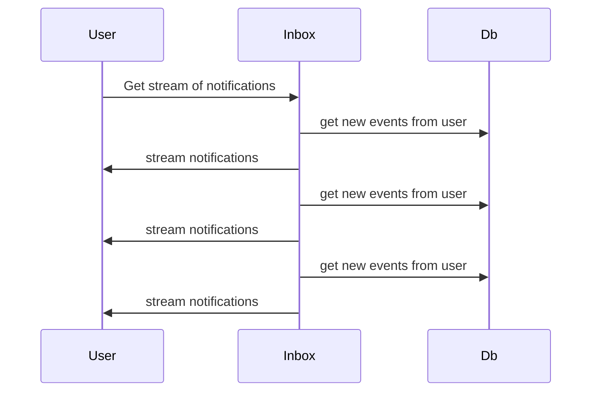

# Overview

The service will be split in 2 workers for scalability and availability.

<!-- - Publisher worker: will be responsable for handling notification creation requests, in this first approach, it will get all updates from Push service for the subscribed users -->
- Processor worker: will handle the users subscription to events
- Inbox worker: will serve the API to get and handle users notifications

The workers will share a database to store the notifications and the subscribed users with their privacy configurations.
<!-- 
## Publisher worker

This worker is responsible of proxing the users requests that want to subscribe to notifications. The Publisher worker is a proxy between the user and the Push Service, this way it will store the users (and their privacy configurations) to the Database.

### Use Case: A user subscribes to event updates

```mermaid
sequenceDiagram
  user->>Publisher: subscribe to notifications (+ sign)
  Publisher->>Push: subscribe to notifications (+ sign)
  Publisher->>DB: store in db subscribed user
``` -->

## Processor worker

This worker will get from Push server all new notifications from all the subscribed users and store them in the database so then they can be send to the users


### Use Case: Get new events from all subscribed users

```mermaid
sequenceDiagram
  Push->>SQS: send new notifications for channel
  SQS->>Processor: send new notifications for channel
  Processor->>DB: store in db new events from all subscribed users
```

## Inbox worker

The worker in charge or retrieving the notifications to the user

### Use Case: Subscribe to notifications

Returns a stream of all the notifications

**Endpoint**
- `GET /notifications/events`
- Authentication: signed fetch, the user id will be infered from that

```
event: item-sold
id: abcdef
data: { "id": "..", "timestamp": 213132, "source": "Marketplace", "type": "item-sold", "thumbnailUrl": "", "title": "", "description": "", "link": "", "read": false }
```




## Get notifications
- `GET /notifications?from=&size=&only-new=true`
- Authentication: signed fetch, the user id will be infered from that

Return:

```json
[
  {
    "id": "..",
    "timestamp": 213132,
    "source": "Marketplace",
    "type": "item-sold",
    "thumbnailUrl": "",
    "title": "",
    "description": "",
    "link": "",
    "read": false
  }
]
```

This endpoint will query the notifications table for user notifications and will contain (probably as harcoded string templates in the first version) a way to transform the notification data into the actual notification fields expected by the UI. If filtering by the only-read parameter, then only not read notifications will be retrieved.


## Change notification read status

- `PUT /notifications/read { notificationIds: ['notification-id-1', 'notification-id-2'], from: 12343435345 }`
- Authentication: signed fetch

Mark notification as read, this action is unreversible. The notifications to be marked as read will be infered from the ids in the request body, or it will mark all notifications as read from a given timestamp. Exactly one of them must be present in the body.

We need to remember to ensure only the user notifications can be updated, for example:

```sql
UPDATE notifications SET read = ${read} WHERE id = ${id} and address = ${address}
```

# Run locally

First you need Docker running and the config in `.env`, then start the database

```
yarn rundb:local
```

Then, start the server

```
yarn install
yarn start:local
```

Then you need to run the SQS queue, for that you need to have installed python, localstack and awslocal


### Prerequisites

Please make sure to install the following tools on your machine before moving ahead:

```
python (Python 3.7 up to 3.10 is supported)
pip (Python package manager)
docker
```

### Installation

Install localstack using the Python package manager.

```
$ python3 -m pip install localstack
```

Then follow the steps to install the [awslocal](https://docs.localstack.cloud/user-guide/integrations/aws-cli/).


## Create the queue

```
awslocal sqs create-queue --queue-name localstack-queue
```

## Send a notification to the queue

```
awslocal sqs send-message --queue-url http://localhost:4566/000000000000/sample-queue \
--message-body '{
	"sid": 121,
	"users": ["0x35B84d6848D16415177c64D64504663b998A6ab4"],
	"sender": "0x35B84d6848D16415177c64D64504663b998A6ab4",
	"payload": {
		"data": {
			"app": "Shunya",
			"sid": "121",
			"url": "https://shunya.fi/",
			"acta": "https://shunya.fi",
			"aimg": "https://shunya.fi/_nuxt/img/shunya.cfece51.png",
			"amsg": "Your portfolio is up by 0.08% since yesterday.",
			"asub": "Assets Daily",
			"icon": "https://gateway.ipfs.io/ipfs/QmQM97KUTGTT6nt6Xd7xAJpdGB8adiJ1LVUJoN8RoFUYfx",
			"type": "3",
			"epoch": "1660554419",
			"appbot": "0",
			"hidden": "0",
			"secret": ""
		},
		"notification": {
			"body": "Your portfolio is up by 0.08% since yesterday.",
			"title": "Shunya - Assets Daily"
		}
	},
	"epoch": "1660554419",
	"topic": "Notification",
	"subtopic": "Channel"
}'
```