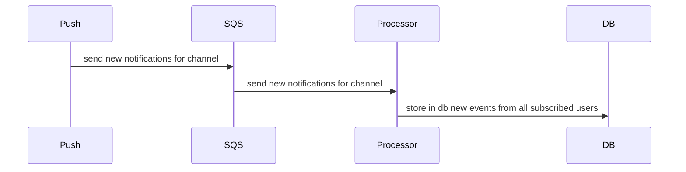
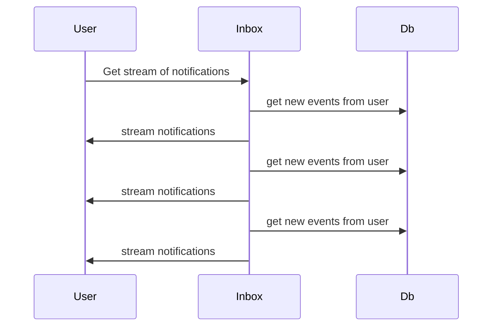

# Overview

The service will be split in 2 workers for scalability and availability.

- Processor worker: will handle the users subscription to events
- Inbox worker: will serve the API to get and handle users notifications

The workers will share a database to store the notifications and the subscribed users with their privacy configurations.


## Processor worker

This worker will get from SQS Queue all new notifications sent by Push Service from all the subscribed users and store them in the database so then they can be send to the users

### Use Case: Get new events from all subscribed users



## Inbox worker

The worker in charge or retrieving the notifications to the user

### Use Case: Subscribe to notifications

Returns a stream of all the notifications

**Endpoint**
- `GET /notifications/events`
- Authentication: signed fetch, the user id will be infered from that

```
retry: 10000

event: ping

data: {"notification_id":"7d9e62e7-93a1-452d-8397-ab7f8e37a325","origin_id":"91","type":"push","source":"sqs","origin_timestamp":1660554419000,"created_at":1694464865660.472,"updated_at":1694464865660.472,"address":"0xb5D7D1A05f553b5098D9274Df6B292e4e8222314","read":false,"metadata":{"sid":91,"epoch":"1660554419","topic":"Notification","users":["0xb5D7D1A05f553b5098D9274Df6B292e4e8222314"],"sender":"0x35B84d6848D16415177c64D64504663b998A6ab4","payload":{"data":{"app":"Shunya","sid":"121","url":"https://shunya.fi/","acta":"https://shunya.fi","aimg":"https://shunya.fi/_nuxt/img/shunya.cfece51.png","amsg":"Your portfolio is up by 0.08% since yesterday.","asub":"Assets Daily","icon":"https://gateway.ipfs.io/ipfs/QmQM97KUTGTT6nt6Xd7xAJpdGB8adiJ1LVUJoN8RoFUYfx","type":"3","epoch":"1660554419","appbot":"0","hidden":"0","secret":""},"notification":{"body":"Your portfolio is up by 0.08% since yesterday.","title":"Shunya - Assets Daily"}},"subtopic":"Channel"}}

data: {"notification_id":"ad2e1b7d-8b4e-4f5f-9b88-6852c3cd6e2d","origin_id":"152","type":"test","source":"manual","origin_timestamp":1660554419000,"created_at":1694004397627.816,"updated_at":1694004397627.816,"address":"0xb5d7d1a05f553b5098d9274df6b292e4e8222314","read":false,"metadata":{"sid":152,"epoch":"1660554419","topic":"Notification","users":["0xb5d7d1a05f553b5098d9274df6b292e4e8222314"],"sender":"0x35B84d6848D16415177c64D64504663b998A6ab4","payload":{"data":{"app":"Shunya","sid":"121","url":"https://shunya.fi/","acta":"https://shunya.fi","aimg":"https://shunya.fi/_nuxt/img/shunya.cfece51.png","amsg":"Your portfolio is up by 0.08% since yesterday.","asub":"Assets Daily","icon":"https://gateway.ipfs.io/ipfs/QmQM97KUTGTT6nt6Xd7xAJpdGB8adiJ1LVUJoN8RoFUYfx","type":"3","epoch":"1660554419","appbot":"0","hidden":"0","secret":""},"notification":{"body":"Your portfolio is up by 0.08% since yesterday.","title":"Shunya - Assets Daily"}},"subtopic":"Channel"}}

event: ping
```




## Get notifications
- `GET /notifications?from=&size=&only-new=true&limit=10`
- Authentication: signed fetch, the user id will be infered from that

Params:
- `from`: the timestamp of `created_at` to filter the results from (this means all retrieved notifications will have a created_at timestamp >= from)
- `limit`: the amount of items retrieved in the query, default 20 and max 50
- `only-new`: if true, then only no-read notifications will be retrieved. If false, notifications will not filtered by the read status.

Return:

```json
[
   {
      "notification_id":"7d9e62e7-93a1-452d-8397-ab7f8e37a325",
      "origin_id":"91",
      "type":"push",
      "source":"sqs",
      "origin_timestamp":1660554419000,
      "created_at":1694464865660.472,
      "updated_at":1694464865660.472,
      "address":"0xb5D7D1A05f553b5098D9274Df6B292e4e8222314",
      "read":false,
      "metadata":{
         "sid":91,
         "epoch":"1660554419",
         "topic":"Notification",
         "users":[
            "0xb5D7D1A05f553b5098D9274Df6B292e4e8222314"
         ],
         "sender":"0x35B84d6848D16415177c64D64504663b998A6ab4",
         "payload":{
            "data":{
               "app":"Shunya",
               "sid":"121",
               "url":"https://shunya.fi/",
               "acta":"https://shunya.fi",
               "aimg":"https://shunya.fi/_nuxt/img/shunya.cfece51.png",
               "amsg":"Your portfolio is up by 0.08% since yesterday.",
               "asub":"Assets Daily",
               "icon":"https://gateway.ipfs.io/ipfs/QmQM97KUTGTT6nt6Xd7xAJpdGB8adiJ1LVUJoN8RoFUYfx",
               "type":"3",
               "epoch":"1660554419",
               "appbot":"0",
               "hidden":"0",
               "secret":""
            },
            "notification":{
               "body":"Your portfolio is up by 0.08% since yesterday.",
               "title":"Shunya - Assets Daily"
            }
         },
         "subtopic":"Channel"
      }
   },
   {
      "notification_id":"ad2e1b7d-8b4e-4f5f-9b88-6852c3cd6e2d",
      "origin_id":"152",
      "type":"test",
      "source":"manual",
      "origin_timestamp":1660554419000,
      "created_at":1694004397627.816,
      "updated_at":1694004397627.816,
      "address":"0xb5d7d1a05f553b5098d9274df6b292e4e8222314",
      "read":false,
      "metadata":{
         "sid":152,
         "epoch":"1660554419",
         "topic":"Notification",
         "users":[
            "0xb5d7d1a05f553b5098d9274df6b292e4e8222314"
         ],
         "sender":"0x35B84d6848D16415177c64D64504663b998A6ab4",
         "payload":{
            "data":{
               "app":"Shunya",
               "sid":"121",
               "url":"https://shunya.fi/",
               "acta":"https://shunya.fi",
               "aimg":"https://shunya.fi/_nuxt/img/shunya.cfece51.png",
               "amsg":"Your portfolio is up by 0.08% since yesterday.",
               "asub":"Assets Daily",
               "icon":"https://gateway.ipfs.io/ipfs/QmQM97KUTGTT6nt6Xd7xAJpdGB8adiJ1LVUJoN8RoFUYfx",
               "type":"3",
               "epoch":"1660554419",
               "appbot":"0",
               "hidden":"0",
               "secret":""
            },
            "notification":{
               "body":"Your portfolio is up by 0.08% since yesterday.",
               "title":"Shunya - Assets Daily"
            }
         },
         "subtopic":"Channel"
      }
   },
   {
      "notification_id":"7e2dfb6e-b6ae-4b3d-8002-f43c94f3bfc2",
      "origin_id":"150",
      "type":"test",
      "source":"manual",
      "origin_timestamp":1660554419000,
      "created_at":1693998943256.702,
      "updated_at":1694004012157.416,
      "address":"0xb5d7d1a05f553b5098d9274df6b292e4e8222314",
      "read":true,
      "metadata":{
         "sid":150,
         "epoch":"1660554419",
         "topic":"Notification",
         "users":[
            "0xb5d7d1a05f553b5098d9274df6b292e4e8222314"
         ],
         "sender":"0x35B84d6848D16415177c64D64504663b998A6ab4",
         "payload":{
            "data":{
               "app":"Shunya",
               "sid":"121",
               "url":"https://shunya.fi/",
               "acta":"https://shunya.fi",
               "aimg":"https://shunya.fi/_nuxt/img/shunya.cfece51.png",
               "amsg":"Your portfolio is up by 0.08% since yesterday.",
               "asub":"Assets Daily",
               "icon":"https://gateway.ipfs.io/ipfs/QmQM97KUTGTT6nt6Xd7xAJpdGB8adiJ1LVUJoN8RoFUYfx",
               "type":"3",
               "epoch":"1660554419",
               "appbot":"0",
               "hidden":"0",
               "secret":""
            },
            "notification":{
               "body":"Your portfolio is up by 0.08% since yesterday.",
               "title":"Shunya - Assets Daily"
            }
         },
         "subtopic":"Channel"
      }
   }
]
```


## Change notification read status

- `PUT /notifications/read { notificationIds: ['notification-id-1', 'notification-id-2'] }`
- Authentication: signed fetch

Response
```json
{
	"updated": 2
}
```

Mark notifications as read, this action is unreversible. The notifications to be marked as read will be infered from the ids in the request body.

If a notification applies to more than one user, then only the current user's notification will be updated.

## Internal use only -- for testing

- `POST /notifications {sid, users, sender, payload, epoch, topic, subtopic}`
- Authentication: API KEY

Creates a new notification that affects all users in body.users. A full example of the payload can be found at `inbox/resources/sns.example.json`

# Run locally

First you need Docker running and the config in `.env`, then start the database

```
yarn rundb:local
```

Then, start the server

```
yarn install
yarn start:local
```

Then you need to run the SQS queue, for that you need to have installed python, localstack and awslocal


### Prerequisites

Please make sure to install the following tools on your machine before moving ahead:

```
python (Python 3.7 up to 3.10 is supported)
pip (Python package manager)
docker
```

### Installation

Install localstack using the Python package manager.

```
$ python3 -m pip install localstack
```

Then follow the steps to install the [awslocal](https://docs.localstack.cloud/user-guide/integrations/aws-cli/).


## Create the queue

```
awslocal sqs create-queue --queue-name localstack-queue
```

## Send a notification to the queue

```
awslocal sqs send-message --queue-url http://localhost:4566/000000000000/sample-queue \
--message-body '{
	"sid": 121,
	"users": ["0x35B84d6848D16415177c64D64504663b998A6ab4"],
	"sender": "0x35B84d6848D16415177c64D64504663b998A6ab4",
	"payload": {
		"data": {
			"app": "Shunya",
			"sid": "121",
			"url": "https://shunya.fi/",
			"acta": "https://shunya.fi",
			"aimg": "https://shunya.fi/_nuxt/img/shunya.cfece51.png",
			"amsg": "Your portfolio is up by 0.08% since yesterday.",
			"asub": "Assets Daily",
			"icon": "https://gateway.ipfs.io/ipfs/QmQM97KUTGTT6nt6Xd7xAJpdGB8adiJ1LVUJoN8RoFUYfx",
			"type": "3",
			"epoch": "1660554419",
			"appbot": "0",
			"hidden": "0",
			"secret": ""
		},
		"notification": {
			"body": "Your portfolio is up by 0.08% since yesterday.",
			"title": "Shunya - Assets Daily"
		}
	},
	"epoch": "1660554419",
	"topic": "Notification",
	"subtopic": "Channel"
}'
```