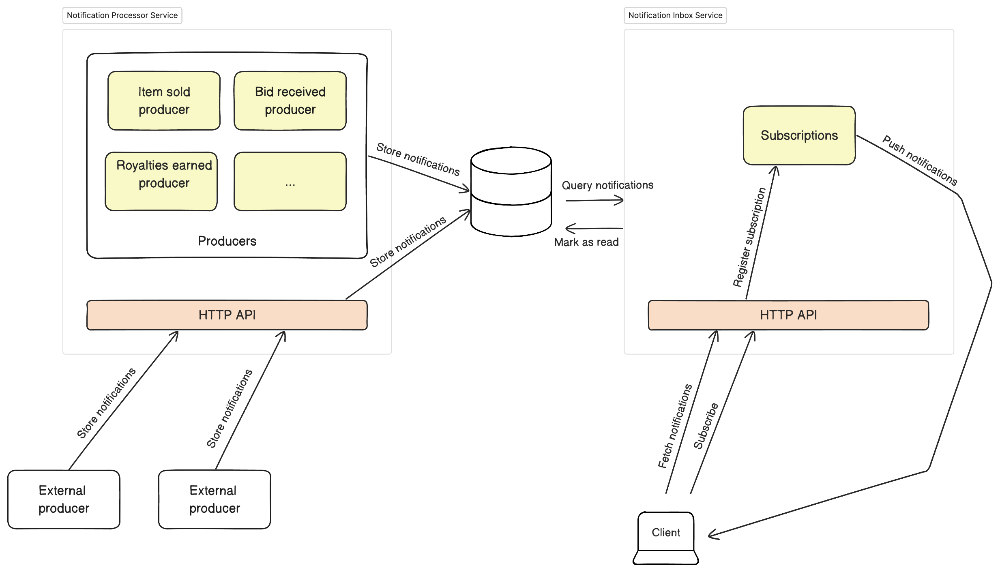
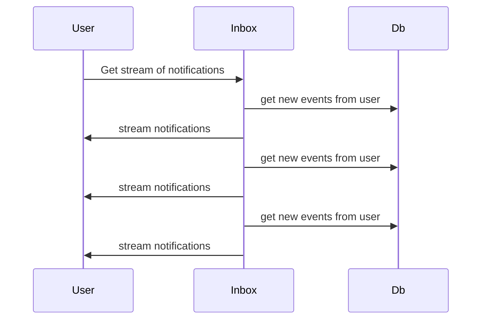

# Overview

The service is split in two separate workers for scalability and availability.

- Processor worker: handles production of notifications and accepts externally produced notifications.
- Inbox worker: serves the API to get user notifications and manages subscriptions for Server Sent Events.

The workers share a database to store the notifications and the subscribed users with their privacy configurations.



## Processor worker

This worker has two main responsibilities:
* Run the internal notification producers periodically to generate new notifications for events as they happen.
* Receive, validate and accept requests from external notification producers and store the notifications in the DB.

## Inbox worker

The worker in charge or retrieving the notifications to the user

### Use Case: Subscribe to notifications

Returns a stream of all the notifications

**Endpoint**
- `GET /notifications/events`
- Authentication: signed fetch, the user id will be inferred from the auth chain.

```
retry: 10000

event: ping

data: {"notification_id":"7d9e62e7-93a1-452d-8397-ab7f8e37a325","origin_id":"91","type":"push","source":"sqs","origin_timestamp":1660554419000,"created_at":1694464865660.472,"updated_at":1694464865660.472,"address":"0xb5D7D1A05f553b5098D9274Df6B292e4e8222314","read":false,"metadata":{"sid":91,"epoch":"1660554419","topic":"Notification","users":["0xb5D7D1A05f553b5098D9274Df6B292e4e8222314"],"sender":"0x35B84d6848D16415177c64D64504663b998A6ab4","payload":{"data":{"app":"Shunya","sid":"121","url":"https://shunya.fi/","acta":"https://shunya.fi","aimg":"https://shunya.fi/_nuxt/img/shunya.cfece51.png","amsg":"Your portfolio is up by 0.08% since yesterday.","asub":"Assets Daily","icon":"https://gateway.ipfs.io/ipfs/QmQM97KUTGTT6nt6Xd7xAJpdGB8adiJ1LVUJoN8RoFUYfx","type":"3","epoch":"1660554419","appbot":"0","hidden":"0","secret":""},"notification":{"body":"Your portfolio is up by 0.08% since yesterday.","title":"Shunya - Assets Daily"}},"subtopic":"Channel"}}

data: {"notification_id":"ad2e1b7d-8b4e-4f5f-9b88-6852c3cd6e2d","origin_id":"152","type":"test","source":"manual","origin_timestamp":1660554419000,"created_at":1694004397627.816,"updated_at":1694004397627.816,"address":"0xb5d7d1a05f553b5098d9274df6b292e4e8222314","read":false,"metadata":{"sid":152,"epoch":"1660554419","topic":"Notification","users":["0xb5d7d1a05f553b5098d9274df6b292e4e8222314"],"sender":"0x35B84d6848D16415177c64D64504663b998A6ab4","payload":{"data":{"app":"Shunya","sid":"121","url":"https://shunya.fi/","acta":"https://shunya.fi","aimg":"https://shunya.fi/_nuxt/img/shunya.cfece51.png","amsg":"Your portfolio is up by 0.08% since yesterday.","asub":"Assets Daily","icon":"https://gateway.ipfs.io/ipfs/QmQM97KUTGTT6nt6Xd7xAJpdGB8adiJ1LVUJoN8RoFUYfx","type":"3","epoch":"1660554419","appbot":"0","hidden":"0","secret":""},"notification":{"body":"Your portfolio is up by 0.08% since yesterday.","title":"Shunya - Assets Daily"}},"subtopic":"Channel"}}

event: ping
```




## Get notifications
- `GET /notifications?from=&size=&onlyUnread=true&limit=10`
- Authentication: signed fetch, the user id will be inferred from the auth chain.

Params:
- `from`: the timestamp of the event triggered the notification to filter the results from (this means all retrieved notifications will have a timestamp >= 
  from)
- `limit`: the number of items retrieved in the query, default 20 and max 50
- `onlyUnread`: if true, then only unread notifications will be retrieved. If false, notifications will not be filtered by the read status.

Return:

```json
[
  {
    "id": "3a33a38a-e17a-4153-926b-c18f1e57e3e1",
    "type": "bid_accepted",
    "address": "0xb5D7D1A05f553b5098D9274Df6B292e4e8222314",
    "metadata": {
      "link": "https://decentraland.zone/marketplace/contracts/0x5d670bab052f21c3b1984231b1187be34852db24/tokens/105312291668557186697918027683670432318895095400549111254310977537",
      "image": "https://peer.decentraland.zone/lambdas/collections/contents/urn:decentraland:mumbai:collections-v2:0x5d670bab052f21c3b1984231b1187be34852db24:1/thumbnail",
      "price": "20000000000000000000",
      "title": "Bid Accepted",
      "rarity": "mythic",
      "seller": "0x35B84d6848D16415177c64D64504663b998A6ab4",
      "network": "polygon",
      "nftName": "Smart Wearable Example II",
      "category": "wearable",
      "description": "Your bid for 20.00 MANA for this Smart Wearable Example II was accepted."
    },
    "timestamp": "1701379983",
    "read": true,
    "created_at": "2023-12-05T21:03:00.280Z",
    "updated_at": "2023-12-06T10:27:06.046Z"
  },
  {
    "id": "f098bed0-bff9-4ebe-a160-5687ffa4fe36",
    "type": "item_sold",
    "address": "0xb5D7D1A05f553b5098D9274Df6B292e4e8222314",
    "metadata": {
      "link": "https://decentraland.zone/marketplace/contracts/0x5d670bab052f21c3b1984231b1187be34852db24/tokens/105312291668557186697918027683670432318895095400549111254310977537",
      "image": "https://peer.decentraland.zone/lambdas/collections/contents/urn:decentraland:mumbai:collections-v2:0x5d670bab052f21c3b1984231b1187be34852db24:1/thumbnail",
      "title": "Item Sold",
      "rarity": "mythic",
      "seller": "0xb5D7D1A05f553b5098D9274Df6B292e4e8222314",
      "network": "polygon",
      "nftName": "Smart Wearable Example II",
      "category": "wearable",
      "description": "You just sold this Smart Wearable Example II."
    },
    "timestamp": "1701357331",
    "read": true,
    "created_at": "2023-12-05T21:02:02.754Z",
    "updated_at": "2023-12-06T10:27:06.046Z"
   }
]
```

## Change notification read status

- `PUT /notifications/read { notificationIds: ['notification-id-1', 'notification-id-2'] }`
- Authentication: signed fetch

Response
```json
{
  "updated": 2
}
```

Mark notifications as read, this action is irreversible. The request body must contain the notification ids to be marked as read.

## Store notification by external producer

- `POST /notifications {type, address, eventKey, metadata, timestamp}`
- Authentication: API KEY

Creates a new notification and stores it in the DB. A full example of the payload can look like this:

```http request
POST /notifications HTTP/1.1
Content-Type: application/json
Authorization: Bearer <API_KEY>

{
  "type": "item_sold",
  "address": "0xb5D7D1A05f553b5098D9274Df6B292e4e8222314",
  "eventKey": "0xf17828d89d6056215d65451fc61a802f5054fa01aa0acc39b644dc191086dd8b",
  "metadata": {
    "link": "https://market.decentraland.zone/contracts/0x040d868f15e4a943a04b7119a9bb3b546714e7cf/tokens/105312291668557186697918027683670432318895095400549111254310977544",
    "image": "https://peer.decentraland.zone/lambdas/collections/contents/urn:decentraland:mumbai:collections-v2:0x040d868f15e4a943a04b7119a9bb3b546714e7cf:1/thumbnail",
    "title": "Item Sold",
    "rarity": "legendary",
    "seller": "0x099224485b542351e3071ae2a4855bea98dd8285",
    "nftName": "Toga Female combined",
    "category": "wearable",
    "description": "You just sold this Toga Female combined"
  },
  "timestamp": 1680108689
}
```

# Run locally

### Prerequisites

Please make sure to have a postgres DB running (locally, docker, any external provider).  You can quickly spin off a new Postgres instance using Docker using:

```
yarn rundb:local
```

### Run the service
Once the DB is up and running, set up the config in `.env`.

Finally, start the servers.

```
yarn
yarn start:local
```

