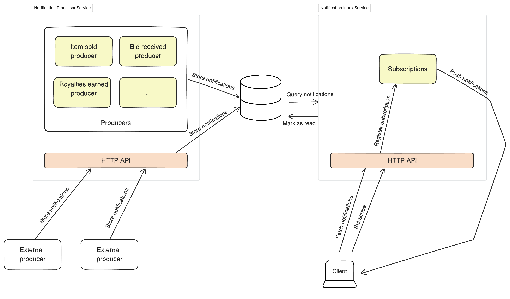

# Notifications Workers

[](https://coveralls.io/github/decentraland/notifications-workers)

The Notifications Workers service is split into two separate workers for scalability and availability. The service manages user notifications across the Decentraland platform, handling notification production, storage, delivery via Server-Sent Events, and email notifications via SendGrid.

This server interacts with AWS SNS for event notifications, PostgreSQL for notification storage, and SendGrid for email delivery in order to provide users with real-time notifications about marketplace events, social interactions, and other platform activities.

## Table of Contents

- [Features](#features)
- [Dependencies & Related Services](#dependencies--related-services)
- [API Documentation](#api-documentation)
- [Database Schema](#database-schema)
- [Getting Started](#getting-started)
  - [Prerequisites](#prerequisites)
  - [Installation](#installation)
  - [Configuration](#configuration)
  - [Running the Service](#running-the-service)
- [Testing](#testing)
- [How to Contribute](#how-to-contribute)
- [License](#license)

## Features

- **Processor Worker**: Handles production of notifications and accepts externally produced notifications. Runs internal notification producers periodically to generate new notifications for events as they happen.
- **Inbox Worker**: Serves the API to get user notifications and manages subscriptions for Server-Sent Events (SSE) for real-time notification streams.
- **Email Notifications**: Supports email notification delivery via SendGrid with customizable templates and email confirmation flow.
- **Notification Management**: Provides REST API for retrieving notifications, marking as read, and managing user preferences.
- **Real-time Delivery**: Server-Sent Events (SSE) for real-time notification streams to clients.
- **External Integration**: Accepts notifications from external producers via API with API key authentication.

## Dependencies & Related Services

This service interacts with the following services:

- **[Marketplace](https://github.com/decentraland/marketplace)**: Source of marketplace events (item sold, bid received, etc.)
- **[Social Service](https://github.com/decentraland/social-service-ea)**: Source of social events (friend requests, friend accepted)
- **[Catalyst](https://github.com/decentraland/catalyst)**: Content server for profile data used in notification metadata

External dependencies:

- **PostgreSQL**: Database for notification storage, user subscriptions, and email confirmations
- **AWS SNS**: Event bus for receiving notification events from various services
- **SendGrid**: Email service for notification delivery

## API Documentation

The API is fully documented using the [OpenAPI standard](https://swagger.io/specification/). The schema is located at [docs/openapi.yaml](docs/openapi.yaml).

### Key Endpoints

#### Subscribe to Notifications (Server-Sent Events)

- **Endpoint**: `GET /notifications/events`
- **Authentication**: Signed fetch, the user id will be inferred from the auth chain
- **Response**: Server-Sent Events stream with notification data

Example response:

```
retry: 10000

event: ping

data: {"notification_id":"7d9e62e7-93a1-452d-8397-ab7f8e37a325","origin_id":"91","type":"push","source":"sqs","origin_timestamp":1660554419000,"created_at":1694464865660.472,"updated_at":1694464865660.472,"address":"0xb5D7D1A05f553b5098D9274Df6B292e4e8222314","read":false,"metadata":{...}}

event: ping
```

#### Get Notifications

- **Endpoint**: `GET /notifications?from=&size=&onlyUnread=true&limit=10`
- **Authentication**: Signed fetch, the user id will be inferred from the auth chain
- **Query Parameters**:
  - `from`: The timestamp of the event triggered the notification to filter the results from (all retrieved notifications will have a timestamp >= from)
  - `limit`: The number of items retrieved in the query, default 20 and max 50
  - `onlyUnread`: If true, then only unread notifications will be retrieved. If false, notifications will not be filtered by the read status.

Example response:

```json
[
  {
    "id": "3a33a38a-e17a-4153-926b-c18f1e57e3e1",
    "type": "bid_accepted",
    "address": "0xb5D7D1A05f553b5098D9274Df6B292e4e8222314",
    "metadata": {
      "link": "https://decentraland.zone/marketplace/contracts/...",
      "image": "https://peer.decentraland.zone/...",
      "price": "20000000000000000000",
      "title": "Bid Accepted",
      "rarity": "mythic",
      "seller": "0x35B84d6848D16415177c64D64504663b998A6ab4",
      "network": "polygon",
      "nftName": "Smart Wearable Example II",
      "category": "wearable",
      "description": "Your bid for 20.00 MANA for this Smart Wearable Example II was accepted."
    },
    "timestamp": "1701379983",
    "read": true,
    "created_at": "2023-12-05T21:03:00.280Z",
    "updated_at": "2023-12-06T10:27:06.046Z"
  }
]
```

#### Change Notification Read Status

- **Endpoint**: `PUT /notifications/read`
- **Authentication**: Signed fetch
- **Request Body**: `{ notificationIds: ['notification-id-1', 'notification-id-2'] }`
- **Response**: `{ "updated": 2 }`

Mark notifications as read. This action is irreversible.

#### Store Notification by External Producer

- **Endpoint**: `POST /notifications`
- **Authentication**: API KEY (Bearer token)
- **Request Body**: Array of notification objects

```json
[
  {
    "type": "item_sold",
    "address": "0xb5D7D1A05f553b5098D9274Df6B292e4e8222314",
    "eventKey": "0xf17828d89d6056215d65451fc61a802f5054fa01aa0acc39b644dc191086dd8b",
    "metadata": {
      "link": "https://market.decentraland.zone/...",
      "image": "https://peer.decentraland.zone/...",
      "title": "Item Sold",
      "rarity": "legendary",
      "seller": "0x099224485b542351e3071ae2a4855bea98dd8285",
      "nftName": "Toga Female combined",
      "category": "wearable",
      "description": "You just sold this Toga Female combined"
    },
    "timestamp": 1680108689
  }
]
```

### Email Subscriptions

#### Check Email Subscription

- **Endpoint**: `GET /subscription`
- **Authentication**: Signed fetch
- **Response**: Subscription object with confirmed email. If the user is currently validating their email, the field `unconfirmedEmail` will contain the email that is still pending confirmation.

#### Set Email

- **Endpoint**: `PUT /set-email`
- **Authentication**: Signed fetch
- **Request Body**: `{ email: "some@email.com" }`

Starts the email confirmation process. The email will be set into a pending state until the user confirms ownership.

> If the email sent in the request is an empty string, the email will be removed from the subscription and email notifications will be deactivated for the user.

#### Confirm Email

- **Endpoint**: `PUT /confirm-email`
- **Authentication**: Signed fetch
- **Request Body**: `{ address: "0x123", code: "123456" }`

Confirms the email ownership using the code sent to the email address.

## Database Schema

See [docs/database-schema.md](docs/database-schema.md) for detailed schema, column definitions, and relationships.

## Getting Started

### Prerequisites

Before running this service, ensure you have the following installed:

- **Node.js**: Version 16.x or higher (LTS recommended)
- **Yarn**: Version 1.22.x or higher
- **Docker**: For containerized deployment and local development dependencies
- **PostgreSQL**: Version 14+ (or use Docker Compose)

### Installation

1. Clone the repository:

```bash
git clone https://github.com/decentraland/notifications-workers.git
cd notifications-workers
```

2. Install dependencies:

```bash
yarn install
```

3. Build the project:

```bash
yarn build
```

### Configuration

The service uses environment variables for configuration. Create a `.env` file in the root directory containing the environment variables for the service to run.

Key configuration variables include:

- `PG_COMPONENT_PSQL_CONNECTION_STRING`: PostgreSQL connection string
- `AWS_SNS_ARN`: SNS topic ARN for receiving notification events
- `SENDGRID_API_KEY`: SendGrid API key for email delivery
- `API_KEY`: API key for external notification producers

### Running the Service

#### Setting up the environment

In order to successfully run this server, external dependencies such as databases must be provided.

To do so, this repository provides you with a `docker-compose.yml` file for that purpose. In order to get the environment set up, run:

```bash
yarn rundb:local
```

Or manually:

```bash
docker-compose up -d
```

This will start:
- PostgreSQL database

#### Running in development mode

Once the DB is up and running, set up the config in `.env`, then start the servers:

```bash
yarn start:local
```

This will start both workers:
- **Processor Worker**: Handles notification production and external notifications
- **Inbox Worker**: Serves the API and manages SSE subscriptions

## Testing

This service includes comprehensive test coverage with both unit and integration tests.

### Running Tests

Run all tests:

```bash
yarn test
```

Run tests in watch mode:

```bash
yarn test --watch
```

### Test Structure

- **Unit Tests**: Test individual components and functions in isolation
- **Integration Tests**: Test the complete request/response cycle

For detailed testing guidelines and standards, refer to our [Testing Standards](https://github.com/decentraland/docs/tree/main/development-standards/testing-standards) documentation.

## Architecture

The service is split into two separate workers for scalability and availability:



- **Processor Worker**: Handles production of notifications and accepts externally produced notifications
- **Inbox Worker**: Serves the API to get user notifications and manages subscriptions for Server-Sent Events

The workers share a database to store the notifications and the subscribed users with their privacy configurations.

## AI Agent Context

For detailed AI Agent context, see [docs/ai-agent-context.md](docs/ai-agent-context.md).

---

**Note**: This is a monorepo containing two separate workers. Both workers must be running for the complete notification system to function properly.
